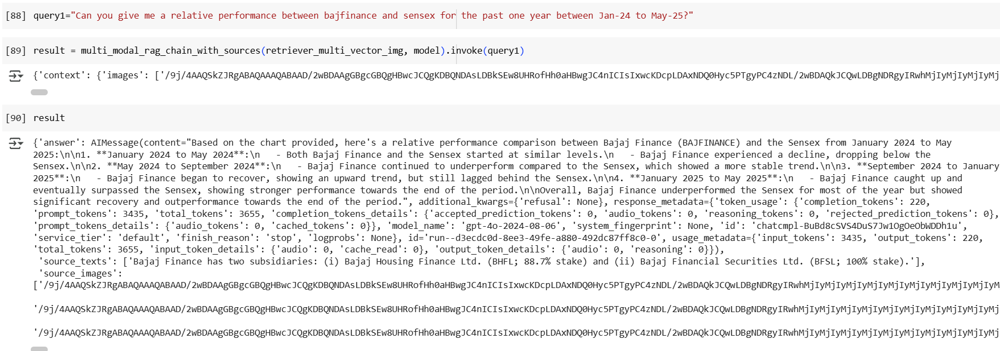
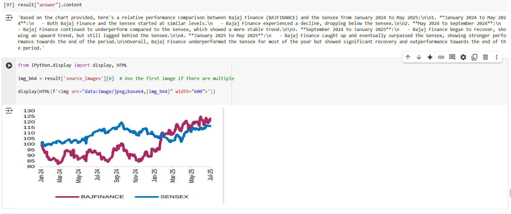
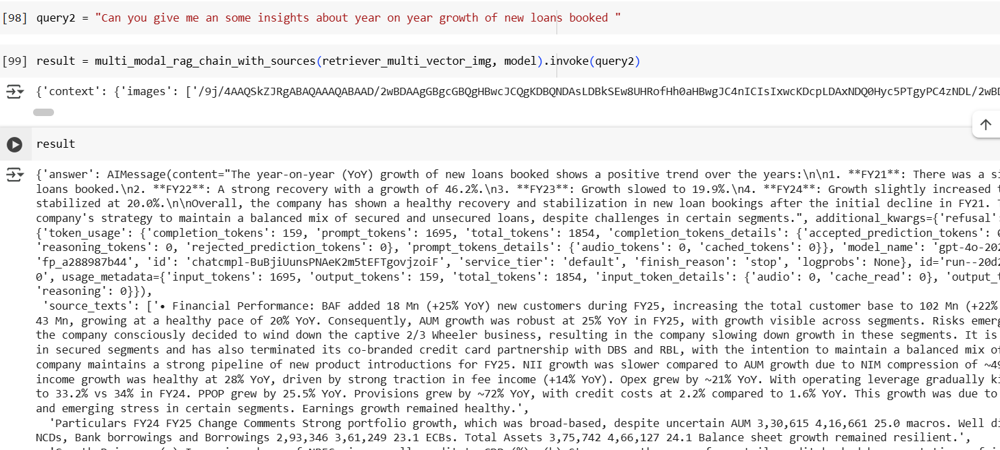
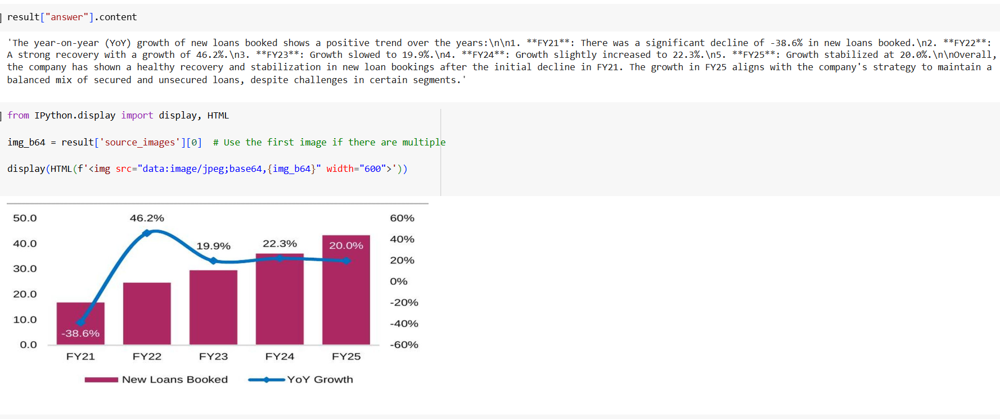

# Multimodal RAG Project

This project implements a multimodal Retrieval-Augmented Generation (RAG) architecture. It is designed to handle various data types and facilitate efficient data ingestion and retrieval processes.

## Project Structure

```
multimodal-rag-project
├── src
│   ├── ingestion
│   │   ├── __init__.py
│   │   └── pipeline.py
│   ├── retriever
│   │   ├── __init__.py
│   │   └── pipeline.py
│   ├── llm_output
│   │   ├── __init__.py
│   │   └── pipeline.py
│   ├── main.py
│   └── image_processing
│       └── pipeline.py
├── requirements.txt
└── README.md
```

## Installation

To set up the project, clone the repository and install the required dependencies:

```bash
pip install -r requirements.txt
```

## Usage

1. **Ingestion Pipeline**: Use the `IngestionPipeline` class from `src/ingestion/pipeline.py` to load, process, and save data.
   
   Example:
   ```python
   from src.ingestion.pipeline import IngestionPipeline

   ingestion_pipeline = IngestionPipeline()
   ingestion_pipeline.load_data('data/source')
   ingestion_pipeline.process_data()
   ingestion_pipeline.save_data('data/processed')
   ```

2. **Retriever Pipeline**: Use the `RetrieverPipeline` class from `src/retriever/pipeline.py` to retrieve and format results from the stored data.

   Example:
   ```python
   from src.retriever.pipeline import RetrieverPipeline

   retriever_pipeline = RetrieverPipeline()
   results = retriever_pipeline.retrieve_data('query')
   formatted_results = retriever_pipeline.format_results(results)
   ```

3. **LLM Output Generation**: Display the original charts/tables/images alongside the LLM's output

**Get both the LLM answer and the source images and texts that the model used**



**source image**



**Get both the LLM answer and the source images and texts that the model used**


**source image**
